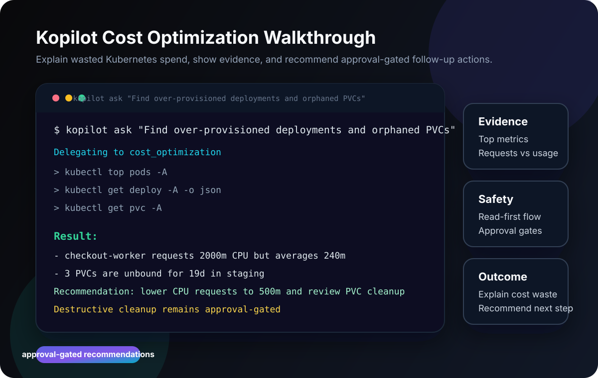
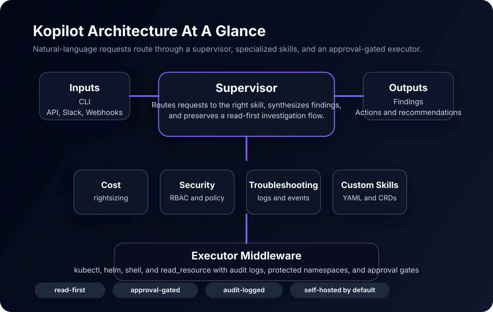

# Kopilot


**Find wasted Kubernetes spend before it lands on the bill.**

Kopilot is an approval-gated AI operator for Kubernetes teams. It investigates
over-provisioned workloads, idle resources, and orphaned storage from one
prompt, explains the evidence in plain English, and recommends the next safe
action.

> Naming note: the Python package and Kubernetes API group are `kubedevaiops`;
> the CLI is available as both `kopilot` and `kubedevaiops`.

**Built for**
- Platform and DevOps teams managing noisy multi-namespace clusters
- Operators who want self-hosted automation with audit logs
- Teams that want recommendations first and approval before risky cleanup



## 30-Second Demo

```bash
git clone https://github.com/kopilot-ai/kopilot && cd kopilot
pip install -e .
kopilot ask "Find over-provisioned deployments and orphaned PVCs across all namespaces"
```

What the first run should give you:
- Evidence from cluster metrics and live object inspection
- Plain-English explanation of where waste is coming from
- Rightsizing and cleanup recommendations, with destructive follow-up left
  behind approval gates

## Safety Model

- **Read-first by default**: investigations start with `get`, `describe`,
  `logs`, and metrics collection before any mutation is considered.
- **Approval-gated changes**: destructive actions (deletes, drains, cordons,
  taints, patches, scales, `helm uninstall`/`rollback`) are never executed
  directly. The executor registers a pending approval request; a human reviews
  it via `GET /approvals` and decides with
  `POST /approvals/{id}/approve` or `/deny`. Approvals are single-use and
  expire after 10 minutes.
- **Protected namespaces**: destructive actions on `kube-system`,
  `kube-public`, and `kube-node-lease` (configurable) are refused outright and
  cannot be approved.
- **API authentication**: bearer-token auth (`API_AUTH_TOKEN`) on task,
  history, metrics, and approval endpoints; HMAC-signed webhooks
  (`API_WEBHOOK_SECRET`).
- **Audit trail**: every delegated task, executed command, and approval
  decision is recorded as structured audit events.
- **Self-hosted posture**: the core deployment model assumes you control the
  cluster access path — and the RBAC of the service account remains the
  authoritative boundary; the safety layer is defense in depth on top of it.



## Cost Optimization Proof Pack

| Use case | Prompt | Expected outcome |
|----------|--------|------------------|
| Rightsizing workloads | `Find over-provisioned deployments across all namespaces` | Highlights requests vs observed usage and suggests safer request targets |
| Idle resource review | `Show me resources that look idle and worth review` | Flags low-usage workloads without auto-deleting them |
| Orphaned storage | `List PVCs that are not attached to running workloads` | Surfaces old storage objects with namespace and age context |
| Safe follow-up plan | `Recommend the next cost-saving actions for staging` | Produces an ordered plan that still keeps destructive cleanup approval-gated |

## Project Surfaces

- [Getting started](#quick-start)
- [Roadmap](ROADMAP.md)
- [Changelog](CHANGELOG.md)
- [Issue templates](.github/ISSUE_TEMPLATE/)

## AI-Native Interop

Kopilot now exposes one concrete interop surface and two discovery surfaces:

- `kopilot mcp` runs an MCP server for external agent clients
- `GET /skills/portable` exposes enabled skills as portable manifests
- `GET /.well-known/agent-manifest.json` exposes an async-first discovery document

```bash
kopilot mcp --transport stdio
```

Current skill model:

- **Built-in YAML skills** ship with the package
- **Mounted YAML skills** can be loaded through `SKILL_DIRS`
- **AISkill CRDs** are the planned next source and will map to the same portable manifest shape

Agent-to-agent note:

- MCP is the implemented tool-level interoperability layer today
- ACP has folded into the broader agent-to-agent layer, so Kopilot keeps an async task API and
  discovery manifest now instead of claiming full protocol support prematurely

## Key Architecture Principles

1. **No hardcoded tools** — The LLM constructs any command it needs. The
   executor middleware provides `run_kubectl`, `run_helm`, `run_shell`, and
   `read_resource` as generic capabilities.

2. **Skills = Sub-Agents** — Each skill is defined in a **YAML file** with a
   domain-specific system prompt and documentation. At runtime, it becomes
   a fully autonomous ReAct agent that reasons, plans, and executes.

3. **Dynamic skill loading** — Skills are loaded from:
   - Built-in YAML files shipped with the package
   - Extra directories (e.g. ConfigMap volumes in K8s)
   - AISkill CRDs applied to the cluster (planned)

4. **Supervisor pattern** — A coordinator agent routes user requests to the
   best sub-agent(s), allowing multi-domain tasks via parallel delegation.

5. **Safety-first execution** — Every command goes through a safety layer
   that blocks operations on protected namespaces, requires approval for
   destructive actions, and audits everything.

6. **Self-improving agents** — Optional reflection loop evaluates response
   quality and re-plans if the score is below threshold. Feedback is logged
   for continuous improvement.

7. **Multi-provider LLM** — Supports Ollama (local), Gemini, OpenAI,
   Azure OpenAI, and Anthropic. Switch providers via a single env var.

8. **Production observability** — Prometheus `/metrics` endpoint, structured
   audit logging, task history, rate limiting, and execution statistics.

## Skill Definitions (YAML)

Skills are **not Python code**. They are YAML definitions that instruct an LLM:

```yaml
name: security
display_name: Security Operations
description: Kubernetes security auditing and hardening

system_prompt: |
  You are an expert Kubernetes security engineer.
  - Audit RBAC roles and bindings for over-privilege
  - Check pod security contexts and standards
  - Evaluate NetworkPolicy coverage
  - Run compliance checks against CIS Benchmarks
  ...

documentation: |
  # Quick Reference
  - List RBAC: kubectl get roles,rolebindings,clusterroles -A
  - Pod security: kubectl get pods -A -o jsonpath='{...securityContext}'
  ...
```

### Built-in Skills

| Skill | Domain | What it can do |
|-------|--------|----------------|
| `security` | Security & Compliance | RBAC audit, pod security, network policies, CIS benchmarks |
| `administration` | Cluster Admin | Deployments, scaling, rollouts, Helm, namespaces |
| `networking` | Network Ops | Services, Ingress, DNS, connectivity, service mesh |
| `monitoring` | Observability | Resource usage, HPA, events, Prometheus, logging |
| `troubleshooting` | Incident Response | Root cause analysis, crash diagnostics, scheduling |
| `cost_optimization` | FinOps | Right-sizing, idle detection, orphaned resources |

### Adding Custom Skills

Drop a YAML file in `skills/builtin/` or mount it at runtime:

```yaml
name: my_custom_skill
display_name: My Custom Skill
description: Does something specific to my org
system_prompt: |
  You are an expert in [domain]. You know how to...
documentation: |
  Internal runbook for [domain]...
```

Set `SKILL_DIRS=/path/to/extra/skills` or mount a ConfigMap.

## Input Channels

| Channel | Protocol | Description |
|---------|----------|-------------|
| REST API | HTTP/JSON | `POST /tasks` with natural language prompt |
| Slack | Socket Mode | `@mention` or DM the bot |
| Webhooks | HTTP/JSON | `POST /webhook` from ServiceNow, PagerDuty, etc. |
| K8s Events | Watch API | Auto-investigates repeated Warning events |
| CRD | `AITask` | Apply a CRD manifest and the operator handles it |

## Safety & Guardrails

- **Protected namespaces**: `kube-system`, `kube-public`, `kube-node-lease`
  — all destructive operations blocked, including via `--namespace=`, glued
  flags, chained commands, or the namespace as the resource itself.
- **Approval workflow**: delete, drain, cordon, taint, patch, scale, replace,
  `--prune`, and helm uninstall/rollback operations create a pending approval
  request instead of running. Obfuscated invocations (`$(...)`, backticks,
  `eval`, `xargs kubectl`) are also gated.
- **Risk assessment**: every command is classified (LOW / MEDIUM / HIGH /
  CRITICAL) before execution, and each task reports the highest risk seen.
- **Rate limiting**: 50 tool calls per 5 minutes per task.
- **Execution hygiene**: 90s subprocess timeouts with process-group kill,
  2 MB output caps, no automatic retry of mutating commands.
- **Audit trail**: structured logs of every command, delegation, approval
  decision, and result.
- **Blocked patterns**: `rm -rf /`, `dd of=/dev/*`, `mkfs`, fork bombs,
  `shutdown`/`reboot` and similar are hard-blocked with no approval path.

## Quick Start

### Prerequisites

- Python 3.11+ (tested on 3.13)
- One of: Ollama (local), Gemini API key, or OpenAI API key
- kubectl configured with cluster access
- Optional: Podman or Docker for container builds

### Install & Run

```bash
cd kopilot
pip install -e ".[dev]"
cp .env.example .env    # Edit with your LLM provider settings
kopilot serve --port 8080
```

### With Gemini

```bash
export LLM_PROVIDER=gemini
export GEMINI_API_KEY=your-api-key
export GEMINI_MODEL=gemini-2.5-flash
kopilot serve
```

### With local Ollama

```bash
ollama pull qwen3:8b
export LLM_PROVIDER=ollama
export LLM_MODEL=qwen3:8b
kopilot serve
```

### Submit a Task

```bash
curl -X POST http://localhost:8080/tasks \
  -H "Content-Type: application/json" \
  -d '{"prompt": "List all nodes and check their health"}'
```

### Submit with Reflection (self-improving)

```bash
curl -X POST http://localhost:8080/tasks \
  -H "Content-Type: application/json" \
  -d '{"prompt": "Audit RBAC for over-privileged accounts", "reflect": true}'
```

### One-shot CLI

```bash
kopilot ask "What pods are running in kube-system?"
```

## Configuration

All settings via environment variables or `.env` file:

| Variable | Default | Description |
|----------|---------|-------------|
| `LLM_PROVIDER` | `ollama` | `ollama`, `gemini`, `openai`, `azure_openai`, `anthropic` |
| `LLM_MODEL` | `gpt-oss:20b` | Model name |
| `OLLAMA_BASE_URL` | `http://localhost:11434` | Ollama API endpoint |
| `GEMINI_API_KEY` | (empty) | Google Gemini API key |
| `GEMINI_MODEL` | `gemini-2.5-flash` | Gemini model name |
| `ANTHROPIC_API_KEY` | (empty) | Anthropic API key |
| `ANTHROPIC_MODEL` | `claude-opus-5` | Anthropic model name |
| `API_AUTH_TOKEN` | (empty) | Bearer token for `/tasks`, `/tasks/history`, `/metrics`, `/approvals` |
| `API_WEBHOOK_SECRET` | (empty) | HMAC secret for `/webhook` (disabled when unset) |
| `API_CORS_ORIGINS` | `[]` | CORS origin allowlist (empty = disabled) |
| `SAFETY_PROTECTED_NAMESPACES` | `kube-system,...` | JSON list |
| `SAFETY_REQUIRE_APPROVAL_DESTRUCTIVE` | `true` | Gate destructive ops behind human approval |
| `SAFETY_MAX_CONCURRENT_TASKS` | `5` | Concurrent task limit |
| `SAFETY_READ_PATHS` | `["/etc/kubedevaiops"]` | Directories `read_resource` may read |
| `SLACK_ALLOWED_USERS` | `[]` | Slack user IDs allowed to run tasks |
| `ENABLED_SKILLS` | all 6 built-ins | JSON list of skill names |
| `SKILL_DIRS` | (empty) | Extra dirs (`;`-separated on Windows, `:`-separated on Linux) |
| `LOG_FORMAT` | `json` | `json` or `console` |
| `LOG_LEVEL` | `INFO` | Log level filter |

## Deployment

### Helm Chart

```bash
helm install kubedevaiops ./helm/kubedevaiops \
  --set ollama.baseUrl=http://ollama:11434 \
  --set llm.model="gpt-oss:20b"
```

### Direct Kubernetes

```bash
kubectl apply -f helm/kubedevaiops/crds/
kubectl apply -f deploy/quickstart.yaml
```

### Custom Resource

```yaml
apiVersion: kubedevaiops.io/v1alpha1
kind: AITask
metadata:
  name: security-audit
spec:
  prompt: "Audit RBAC and pod security across all namespaces"
```

## API Reference

| Endpoint | Method | Auth | Description |
|----------|--------|------|-------------|
| `/health` | GET | open | Health check with skills count and LLM provider |
| `/readyz` | GET | open | Readiness probe |
| `/skills` | GET | open | List loaded skills |
| `/skills/portable` | GET | open | Skills as portable manifests |
| `/interop` | GET | open | Agent interoperability manifest |
| `/.well-known/agent-manifest.json` | GET | open | Discovery document |
| `/tasks` | POST | bearer | Submit a task (accepts `prompt`, `reflect`, `namespace`) |
| `/tasks/history` | GET | bearer | Recent task history (configurable `?limit=`) |
| `/approvals` | GET | bearer | List approval requests (`?status=pending`) |
| `/approvals/{id}/approve` | POST | bearer | Approve a gated command (single-use, 10 min TTL) |
| `/approvals/{id}/deny` | POST | bearer | Deny a gated command |
| `/webhook` | POST | HMAC | Webhook handler (X-Kopilot-Signature, sha256) |
| `/metrics` | GET | bearer | Prometheus-compatible metrics |

Bearer auth is enforced when `API_AUTH_TOKEN` is set; without it the server
runs open (development mode) and logs a warning.

## Development

```bash
make dev                  # Install with dev dependencies (editable)
make test                 # Run pytest with coverage
make lint                 # Run ruff linter
make format               # Auto-format code
make run                  # Start the full agent locally
make build-podman         # Build container image with Podman
```

### Local K8s cluster (Podman + Kind)

```bash
podman machine start
bash scripts/setup-local-k8s.sh
kubectl apply -f helm/kubedevaiops/crds/
```

### Running Tests

```bash
# Unit tests only (fast, no external deps)
pytest tests/ -v --ignore=tests/test_integration_smoke.py

# Full suite including integration tests (requires Ollama + K8s)
pytest tests/ -v

# End-to-end smoke test with specific provider
python scripts/smoke_e2e.py gemini
python scripts/smoke_e2e.py ollama
```

## Project Structure

```
src/kubedevaiops/
├── agent/
│   ├── supervisor.py    # Main coordinator with reflection loop
│   ├── subagent.py      # Factory: builds agent from YAML skill definition
│   ├── llm.py           # Multi-provider LLM factory (Ollama, Gemini, OpenAI, etc.)
│   ├── memory.py        # Checkpointing, task context, incident memory
│   └── safety.py        # Risk assessment engine
├── executor/
│   └── middleware.py     # Generic tools + rate limiting + retries + audit
├── skills/
│   ├── base.py          # SkillRegistry (loads + caches sub-agents)
│   ├── loader.py        # YAML discovery (builtin + extra dirs, cross-platform)
│   └── builtin/         # 6 YAML skill definitions
├── inputs/
│   ├── api.py           # FastAPI REST gateway with /metrics
│   ├── slack.py         # Slack bot (Socket Mode)
│   └── k8s_events.py    # Warning event auto-investigation with backoff
├── operator/
│   └── handlers.py      # Kopf CRD handlers with status conditions
└── outputs/
    └── audit.py         # Structured audit logging

tests/
├── test_api.py           # REST gateway tests
├── test_config.py        # Configuration tests (all providers)
├── test_executor.py      # Executor middleware tests
├── test_llm.py           # LLM factory tests
├── test_memory.py        # Memory/checkpointer tests
├── test_middleware.py     # Rate limiter, safety, edge cases
├── test_operator.py      # Kopf handler tests
├── test_safety.py        # Safety guardrail tests
├── test_skills.py        # Skill loader tests
├── test_supervisor.py    # Supervisor agent tests (mocked LLM)
└── test_integration_smoke.py  # Live Ollama + Gemini + K8s tests
```

## Architecture Decisions

| Decision | Choice | Rationale |
|----------|--------|-----------|
| Agent framework | LangChain v1+ / LangGraph | Production-grade multi-agent with checkpointing |
| Operator framework | Kopf | Python-native, decorator-based, lightweight |
| Local LLM | Ollama | Easy setup, multi-model, tool-calling support |
| Cloud LLM | Gemini | Good tool-calling, fast, cost-effective |
| Safety | Pre-flight checks | Every command assessed before execution |
| Observability | structlog + Prometheus | Structured JSON logs + metrics endpoint |
| Testing | pytest + pytest-asyncio | Async-first, 130+ unit tests incl. adversarial safety cases |

## License

MIT
