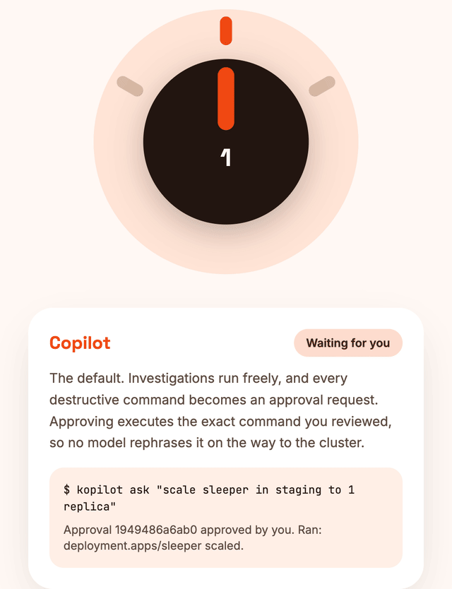
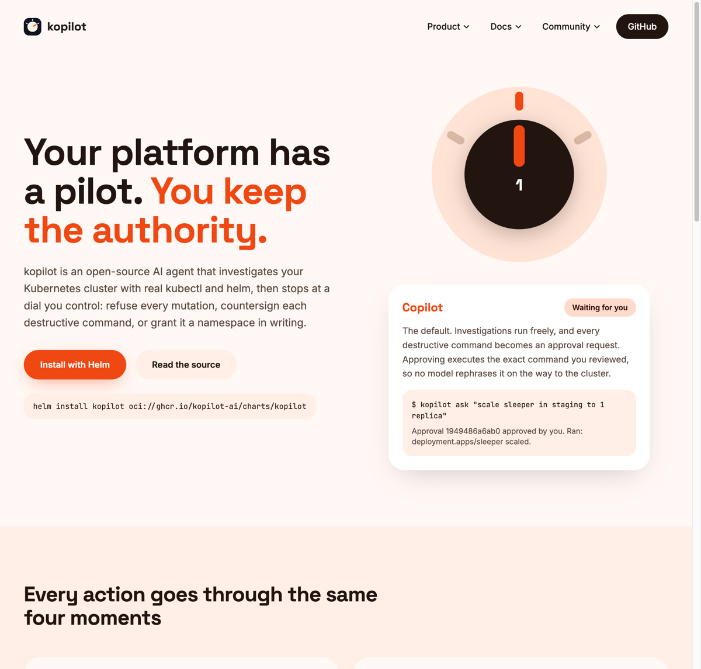

<p align="center">
  
</p>

<h1 align="center">kopilot</h1>

<p align="center"><b>The platform pilot for Kubernetes. It investigates on its own, asks before it acts, and takes the controls only where you grant them.</b></p>

<p align="center">
  <a href="https://kopilot-roan.vercel.app">Website</a> ·
  <a href="https://kopilot-roan.vercel.app/docs">Docs</a> ·
  <a href="CHANGELOG.md">Changelog</a>
</p>

<p align="center">
  
  
  
  
</p>

kopilot is an open-source AI agent for Kubernetes operations. A supervisor
routes plain-language requests to skill sub-agents that investigate your
cluster with real `kubectl` and `helm` through one audited executor. What it
may do without you is a dial you control.

<p align="center">
  
</p>

## The autonomy dial

| Level | Name | What happens |
|---|---|---|
| 0 | Observe | Every mutating command is refused. An `AIPolicy` with `autonomyLevel: 0` is an emergency brake you can `kubectl apply` mid-incident. |
| 1 | Copilot | The default. Investigations run freely; destructive commands wait as approval requests. |
| 2 | Autopilot | Namespace-scoped grants, contained to the policy's own namespace. kopilot acts alone only when every namespace a command names sits inside that grant. |

```yaml
apiVersion: kopilot-ai.github.io/v1alpha1
kind: AIPolicy
metadata:
  name: staging-autopilot
  namespace: staging
spec:
  autonomyLevel: 2
  namespaces: [staging]
```

A namespaced `AIPolicy` can only grant its own namespace; add a second
policy in `namespace: qa` for a second grant. Naming any other namespace is
rejected `Invalid` with a `NamespaceEscape` condition, so one compromised
team's policy can't reach into another team's namespace.

Grants reconcile live and are revoked by deletion. CRITICAL commands, opaque
payloads (`kubectl exec`, `cp`, `attach`), and shell commands never qualify
for autopilot, and protected namespaces such as `kube-system` stay refused
whatever any policy says. Every autonomous act lands in the same approval
ledger a human signs, recorded as `policy:<name>`.

## What you sign is what runs

Destructive commands pause as approval requests. Approving one executes the
exact command you reviewed and returns its output, so no model rephrases
anything between your review and the cluster. Approvals are single-use,
expire in 10 minutes, and journal to SQLite so they survive restarts.

## Install

```bash
helm install kopilot oci://ghcr.io/kopilot-ai/charts/kopilot \
  --version 0.4.0 --namespace kopilot --create-namespace \
  --set llm.provider=ollama
```

The chart ships the CRDs, RBAC, hardened security contexts, and the approval
volume; set `persistence.enabled=true` for a PVC that survives pod
rescheduling. It also generates a random bearer token per release and
stores it in the `kopilot-secrets` Secret; pin your own instead with
`--set api.authToken=<token>`, which is worth doing in CI or when you
already issued one:

```bash
helm install kopilot oci://ghcr.io/kopilot-ai/charts/kopilot \
  --version 0.4.0 --namespace kopilot --create-namespace \
  --set llm.provider=ollama --set api.authToken=$(openssl rand -hex 24)
```

Images are published for amd64 and arm64. Five LLM providers are one env
var away (Ollama self-hosted by default; OpenAI, Azure OpenAI, Anthropic,
Gemini), and no feature depends on a single vendor.

Or run from source. You'll need a kubeconfig pointing at the cluster you
want kopilot to operate on, and Ollama running locally with the default
model already pulled:

```bash
ollama pull gpt-oss:20b
git clone https://github.com/kopilot-ai/kopilot && cd kopilot
pip install -e .
cp .env.example .env    # pick your LLM provider
kopilot serve
```

`kopilot ask` is a separate, standalone one-shot process, not a client of
the `kopilot serve` you just started: it runs the agent in-process and
prints the answer once, with no server or approval loop involved.

```bash
kopilot ask "what pods are failing and why?"
```

### From first curl to first approval

Whichever install path you took, once the API answers on port 8080 (behind
`kubectl port-forward svc/kopilot 8080:8080 -n kopilot` for the Helm
install, or straight from `kopilot serve` run from source), walk a
destructive request through the approval loop:

```bash
# Helm install: read back the token the chart generated (skip if you set
# api.authToken yourself, or if you're running from source with no
# API_AUTH_TOKEN set)
export KOPILOT_TOKEN=$(kubectl get secret kopilot-secrets -n kopilot \
  -o jsonpath='{.data.API_AUTH_TOKEN}' | base64 -d)

# 1. Submit a task that needs a destructive step
curl -X POST http://localhost:8080/tasks \
  -H "Authorization: Bearer $KOPILOT_TOKEN" \
  -H "Content-Type: application/json" \
  -d '{"prompt": "Delete the failed pods in namespace default"}'

# 2. See the exact command it wants to run before it runs
curl http://localhost:8080/approvals -H "Authorization: Bearer $KOPILOT_TOKEN"

# 3. Approve it by id; the command you just reviewed executes as-is
curl -X POST http://localhost:8080/approvals/<id>/approve \
  -H "Authorization: Bearer $KOPILOT_TOKEN" \
  -H "X-Kopilot-Operator: you"
```

More REST examples, including the deny path and a full scripted session,
live in [`examples/README.md`](examples/README.md) and
[`examples/api-session.sh`](examples/api-session.sh).

## Skills are YAML, and they load live

Six sub-agents ship built in: security, administration, networking,
monitoring, troubleshooting, cost optimization. Each is a YAML definition
(system prompt plus reference docs) compiled into an autonomous agent.
Apply an `AISkill` resource with your own `systemPrompt` and it joins the
registry without a restart; delete it and it leaves the same way.

## Surfaces

CLI (`kopilot serve|api|operator|ask|mcp`), a bearer-authenticated REST API,
an MCP server for agent clients, HMAC-verified webhooks, Slack, `AITask`
resources, and auto-investigation of Kubernetes warning events. Prometheus
metrics are served as `kopilot_*`. Full reference:
[API and CLI](https://kopilot-roan.vercel.app/docs/api) ·
[Configuration](https://kopilot-roan.vercel.app/docs/configuration) ·
[Deployment](https://kopilot-roan.vercel.app/docs/deployment).

## The website

<p align="center">
  <a href="https://kopilot-roan.vercel.app"></a>
</p>

## Honest limits

- Single replica: the approval queue and event watcher are process-local.
- The safety layer is defense in depth. RBAC on the service account is the
  real boundary.
- The model can be wrong. The dial constrains what runs, not what it
  concludes.
- CRD-driven skills and grants apply in serve mode, where the operator
  shares the process with the executor.

## Development

```bash
make dev      # editable install with dev dependencies
make test     # pytest (200 tests, including adversarial safety cases)
make lint     # ruff
make helm-lint
```

`bash scripts/setup-local-k8s.sh` brings up a kind cluster with the CRDs
installed. See [CONTRIBUTING.md](CONTRIBUTING.md); safety-model changes need
adversarial tests and maintainer consensus.

## License

Apache-2.0. Brand assets and usage rules live in [`brand/`](brand/).
